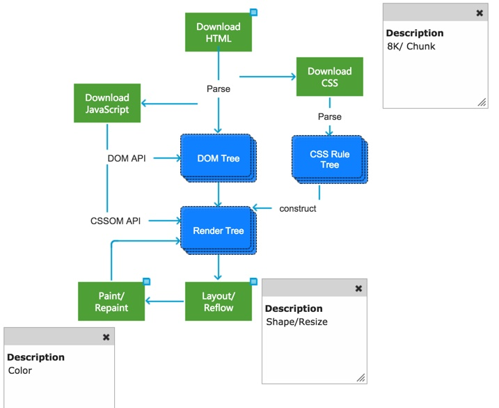

1.  Html

    1.  Html

        1.  Html加载原理

        2.  块级元素

            1.  a span img input select

        3.  行内元素

            1.  div ul ol li dl dt dd h1 p

        4.  空元素

            1.  \<br\> \<hr\> \<link\> \<meta\>

    2.  Html5

        

        1.  浏览器加载原理

            1.  首先，开源浏览器一般以8k每块下载html页面。

                然后解析页面生成DOM树，遇到css标签或JS脚本标签就新起线程去下载他们，并继续构建DOM。

                下载完后解析CSS为CSS规则树，浏览器结合CSS规则树和DOM树生成Render
                Tree。注意：构建CSS Object Model（CSSOM)会阻塞JavaScript的执行。

                JavaScript的执行也会阻塞DOM的构建。

                JavaScript下载后可以通过DOM API修改DOM，通过CSSOM
                API修改样式作用域Render Tree。

                每次修改会造成Render Tree的重新布局和重绘。

                只要修改DOM或修改了元素的形状或大小，就会触发Reflow，单纯修改元素的颜色只需Repaint一下（调用操作系统Native
                GUI的API绘制）。

2.  浏览器缓存技术

    1.  常见浏览器内核

        1.  Trident内核：IE,MaxThon,TT,The Word,360,搜狗浏览器等

        2.  Gecko内核：Netscape6及以上版本，FF,MozillaSuite/SeaMonkey等

        3.  Presto内核：Opera7及以上[现为：Blink]

        4.  Webkit内核：Safari,Chrome等[Chrome的:Blink(Webkit的分支)]

    2.  语义化

        1.  用正确的标签做正确的事情

        2.  让页面的内容结构化，结构更清晰，便于对浏览器，搜索引擎解析

        3.  即使在没有样式CSS情况下也以一种文档格式显示，并且是容易阅读的

        4.  搜索引擎的爬虫也依赖于HTML标记确定上下文和各个关键字的权重，利于SEO

        5.  使阅读源代码的人对网站更容易将网站分块，便于阅读维护理解

    3.  渐进增强和优雅降级

        1.  渐进增强：针对低版本浏览器进行构建页面，保证最基本的功能，然后再针对高级浏览器进行效果、交互等改进和追加功能，达到更好的用户体验

        2.  优雅降级：一开始就构建完整的功能，然后再针对低版本的浏览器进行兼容

    4.  defer和async的区别

        1.  defer：此布尔属性被设置为向浏览器指示脚本在文档被解析后执行。

            1.  对于defer，我们可以认为是将外链的js放在了页面底部。js的加载不会阻塞页面的渲染和资源的加载。不过defer会按照原本的js的顺序执行，所以如果前后有依赖关系的js可以放心使用

        2.  async：设置此布尔属性，以指示浏览器如果可能的话，应异步执行脚本。

            1.  对于async，这个是html5中新增的属性，它的作用是能够异步的加载和执行脚本，不因为加载脚本而阻塞页面的加载。一旦加载到就会立刻执行在有async的情况下，js一旦下载好了就会执行，所以很有可能不是按照原本的顺序来执行的。如果js前后有依赖性，用async，就很有可能出错。

        3.  两个属性会有三种可能的情况

            1.  如果async为true，那么脚本在下载完成后异步执行。

            2.  如果async为false，defer为true，那么脚本会在页面解析完毕之后执行。

            3.  如果async和defer都为false，那么脚本会在页面解析中，停止页面解析，立刻下载并且执行。

        4.  alt 和title的区别

            1.  alt是\标签的特有属性，当图片加载失败时显示alt文字

            2.  title属性是global
                attribute之一，作用是提供建议性的信息，通常是鼠标滑动到元素上是显示

        5.  DOCTYPE 作用

            1.  DOCTYPE是用来声明文档类型和DTD规范的，一个主要的用途便是文件的合法性验证

            2.  HTML4.01的doctype

                1.  在HTML4.01中，\<!DOCTYPE\>声明引用DTD，因为HTML4.01基于SGML。DTD规定了标记语言的规则，这样浏览器才能正确的呈现内容。在HTML4.01中有三种\<!DOCTYPE\>声明。

                2.  严格模式

                    1.  \<!DOCTYPE HTML PUBLIC "-//W3C//DTD HTML 4.01//EN"
                        "http://www.w3.org/TR/html4/strict.dtd"\>

                3.  过渡模式：

                    2.  \<!DOCTYPE HTML PUBLIC "-//W3C//DTD HTML 4.01
                        Transitional//EN"
                        "http://www.w3.org/TR/html4/loose.dtd"\>

                4.  框架模式：

                    3.  \<!DOCTYPE HTML PUBLIC "-//W3C//DTD HTML 4.01
                        Frameset//EN"
                        "http://www.w3.org/TR/html4/frameset.dtd"\>

            3.  HTML5的doctype

                5.  HTML5不基于SGML，所以不需要引用DTD。在HTML5中\<!DOCTYPE\>只有一种\<！DOCTYPE
                    html\>

        6.  global attribute

            1.  style class id title data-\*等等

3.  Css

    1.  Css

        1.  盒子模型

            1.  标准盒子模型

            2.  IE盒子模型

        2.  文档流

        3.  选择器

            1.  选择器

            2.  继承性

            3.  优先级算法计算

        4.  三种定位机制

            1.  普通流

            2.  浮动

                6.  元素浮动，脱离文档流，不脱离文本流，位置尽量靠上，并靠左或右

                7.  清除浮动

            3.  绝对定位position

                8.  Static

                9.  Relative

                10. Absolute

                11. Fixed

        5.  Display

            1.  None

            2.  Inline

            3.  Block

            4.  Inline-block

            5.  Table

            6.  Table-cell

            7.  Table-row

            8.  Flex

                12. 作用在flex容器上

                13. 作用在flex子项上

        6.  透明

        7.  块级格式上下文BFC

        8.  Line-height

            1.  理解

            2.  单位，纯数字，百分比三种区别

        9.  Css单位

            1.  px

            2.  %

            3.  Em

            4.  Rem

            5.  Vw,vh,vmin,vmax

        10. Link和import的区别

    2.  Css3

    3.  Css优化，提高性能

4.  Scss

5.  Webpack

    1.  Webpack基本用法

    2.  常用插件

    3.  打包速度优化

6.  JavaScript

    1.  Es3

        1.  基本类型

            1.  值类型

                14. Boolean， number，string，null，undefined，symbol（es6新加）

            2.  引用类型

                15. Object

        2.  类型判断方法

            1.  Typeof 或精确判断使用Object.prototype,toString.call(param)

        3.  ==和===区别

            1.  == 会隐式转换

        4.  String常用方法

        5.  Array常用方法

        6.  Object常用方法

        7.  继承

        8.  作用域链

        9.  原型链

        10. 闭包

        11. 跨域通讯

        12. This指向问题

        13. 正则表达式

    2.  Es5

    3.  Es6

        1.  Var，let，const

        2.  Symbal类型

        3.  Promise

            1.  等待中pending

            2.  完成了resolved

            3.  拒绝了rejected

        4.  Class

        5.  Babel

        6.  箭头函数

        7.  函数

        8.  Set，map，weakmap，weakset

    4.  Es7

        1.  Async await

    5.  常见js功能或算法实现

        1.  防抖

        2.  节流

        3.  快速排序

        4.  递归

        5.  尾递归

        6.  递归转for循环

        7.  浅拷贝

        8.  深拷贝

        9.  函数柯里化

    6.  Js事件循环机制

    7.  XHR，ajax和fetch的区别

    8.  模块化发展历程

7.  Dom

    1.  节点操作

        1.  生成

        2.  删除

        3.  插入

        4.  查询

        5.  事件

            1.  事件绑定方法

            2.  自定义事件

8.  Jquery

9.  Typescript

10. Vue

    1.  Vue

        1.  生命周期

        2.  Mvvm

        3.  虚拟dom

        4.  双向绑定

        5.  组件传值

        6.  Diff算法

        7.  事件总线evetbus

        8.  指令

            1.  通用指令

            2.  自定义指令

        9.  计算属性和监听器computed和watch

        10. Prop

        11. 自定义事件

        12. 插槽

        13. 混入

        14. 过滤器

        15. 其他

            1.  Extend，extends和mixin的区别

                16. extend用于创建vue实例

                17. mixins可以混入多个mixin，extends只能继承一个

                18. mixins类似于面向切面的编程（AOP），extends类似于面向对象的编程

                19. 优先级Vue.extend\>extends\>mixins

            2.  Object.defineProperty和proxy

    2.  Vuex

        1.  状态管理

        2.  State

        3.  Mutation

        4.  Action

        5.  Model

    3.  Vue-router

        1.  路由模式

            1.  History

            2.  Hash

        2.  哨兵函数

            1.  全局哨兵函数

            2.  组件内哨兵函数

        3.  路由传参

        4.  路由跳转

11. React

    1.  React

        1.  生命周期

        2.  单项数据流

        3.  Diff算法

    2.  Redux

    3.  React-router

    4.  Flux

12. http

    1.  三次握手

    2.  请求方法

        1.  Get

        2.  Post

        3.  Put

        4.  Delete

        5.  Patch

    3.  状态码

13. Websocket

    1.  Websocket在vue中的应用

    2.  Websocket在react中的应用

14. node

    1.  node

        1.  常用包使用

        2.  事件循环机制

    2.  koa2

    3.  express

15. mysql

    1.  存储模式

16. Redis

17. 服务器

    1.  Nginx

18. Git

19. web安全

    1.  CSRF 攻击

    2.  XSS

20. docker
